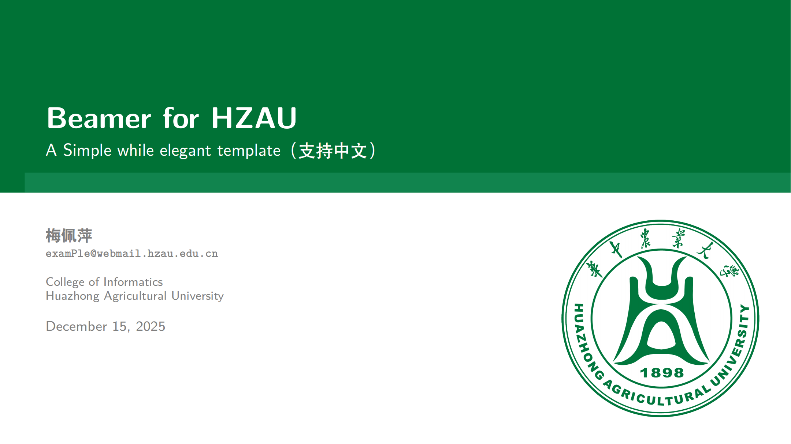
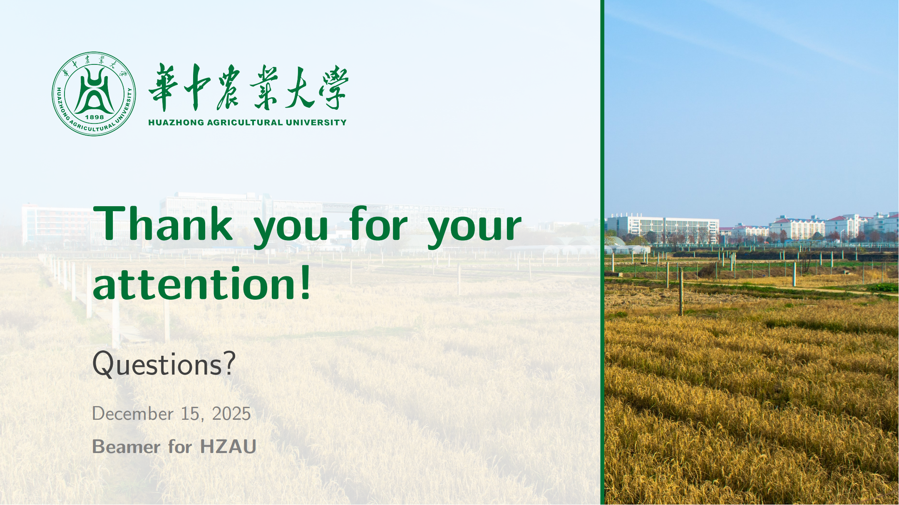

# HZAU Beamer Template

这是一个简洁、优雅且专业的 LaTeX Beamer 模版，专为 **华中农业大学 (HZAU)** 师生设计。

本模版基于 [Verona 主题](https://ctan.org/pkg/beamertheme-verona) 和 [BUCT Beamer Template](https://www.overleaf.com/latex/templates/beamer-for-buct/rndypbwvfxrp) 进行二次开发与定制，融入了华农的官方视觉形象识别系统。

## 📷 预览 (Preview)

<div align="center">
  <table>
    <tr>
      <td align="center">
        
        <br>
        <sub><b>封面页</b></sub>
      </td>
      <td align="center">
        
        <br>
        <sub><b>致谢页</b></sub>
      </td>
    </tr>
  </table>
</div>

## 🎨 模版特色

- **华农定制**: 采用官方标准色“华农绿”作为主色调，内置校徽与标准字素材。
- **中文支持**: 预置 `xeCJK` 宏包，完美支持中文排版。
- **代码高亮**: 集成 `listings` 宏包，适合展示代码片段 (C++, Python 等)。
- **丰富布局**: 包含多种 Block 样式、双栏排版、图文混排及参考文献页示例。
- **优雅排版**: 优化了字体大小与行间距，适合学术汇报与答辩。

## 🔨 使用说明

### 1. 环境要求

您需要在本地安装 TeX 发行版，例如：

- **Windows**: TeX Live 或 MiKTeX
- **macOS**: MacTeX
- **Linux**: TeX Live

### 2. 编译方式

⚠️ **注意**: 由于使用了 `xeCJK` 处理中文字体，**必须使用 XeLaTeX 引擎** 进行编译。

1. 克隆本项目:

    ```bash
    git clone [https://github.com/your-username/HZAUBeamer.git](https://github.com/your-username/HZAUBeamer.git)
    ```

2. 打开 `main.tex` 文件。
3. 将编译器 (Compiler) 设置为 **XeLaTeX**。
4. 编译运行。

### 3\. 个性化设置

- **基本信息**: 在 `main.tex` 的 `\title` (标题), `\subtitle` (副标题), `\author` (作者), `\mail` (邮箱), `\institute` (学院) 中修改为您自己的信息。
- **字体设置**:
  - 模版默认针对 macOS 进行了字体优化（使用了 `\CJKfamily{zhli}` 调用隶书）。
  - **Windows 用户**: 如果编译报错提示找不到字体，请在 `main.tex` 导言区找到 `\providecommand{\lishu}{\CJKfamily{zhli}}`，将其修改为适合您系统的字体命令（如 `\CJKfamily{LiSu}` 或直接使用系统隶书）。

## 📂 文件结构

- `main.tex`: 主文档，演示文稿的内容在这里编写。
- `beamerthemeVerona.sty`: 样式定义文件 (已修改配色和布局)。
- `References.bib`: 参考文献数据库。
- `attachments/`: 存放校徽、背景图等图片素材的文件夹。

## 👏 致谢

本模版站在巨人的肩膀上完成，特别感谢：

1. **主要灵感来源**: [Beamer for BUCT](https://www.overleaf.com/latex/templates/beamer-for-buct/rndypbwvfxrp) (Overleaf Template).
2. **原始主题**: [Verona Theme](https://www.google.com/url?sa=E&source=gmail&q=https://ctan.org/pkg/beamertheme-verona) by Ivan Valbusa.
3. **视觉素材**:
      - [华中农业大学官方网站](https://www.hzau.edu.cn/)
      - [华中农业大学视觉形象识别系统](https://www.hzau.edu.cn/info/1172/12644.htm)
4. **AI 工具**：`gemini-3-pro-preview` 在魔改模板中帮助了很多，包括撰写本 README 文件。

## ⚠️ 免责与版权声明 (Disclaimer)

1. 本项目仅供华中农业大学师生学术交流与学习使用。
2. 模版中使用的校徽、标准字等视觉素材，其版权归 **华中农业大学** 所有。
3. 若本项目中的任何内容无意中侵犯了您的合法权益，请联系作者删除：`ZimingADR@webmail.hzau.edu.cn`

## 📄 许可证

本模版沿用原始 Verona 主题的 LPPL (LaTeX Project Public License) 许可证。
